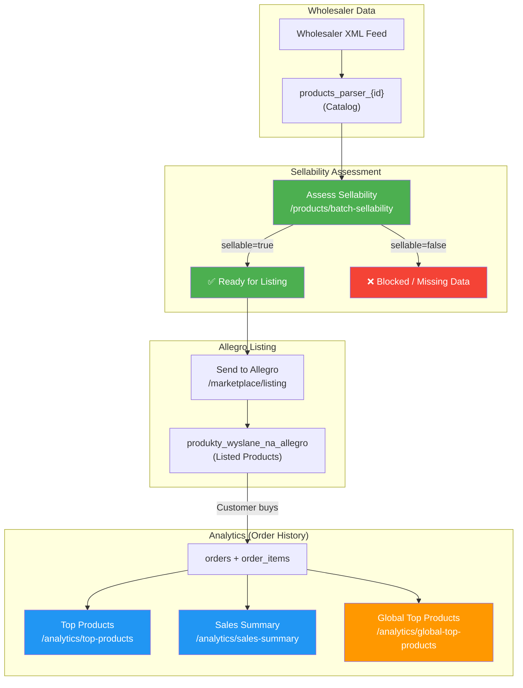

# GAPLI API — Data Contract & Sellability Reference

> **Version:** 1.2.0 | **Date:** 2026-05-07
> **Base URL:** `https://gapli.com/api/v1/integrations`

---

## Table of Contents

1. [Product Data Sources](#1-product-data-sources)
2. [Sellability Assessment](#2-sellability-assessment)
3. [Currency & Monetary Values](#3-currency--monetary-values)
4. [Analytics Endpoints — What They Actually Return](#4-analytics-endpoints)
5. [Data Flow Diagram](#5-data-flow-diagram)
6. [Field Glossary](#6-field-glossary)

---

## 1. Product Data Sources

GAPLI products exist in **three distinct data layers** with different semantics:

| Layer | Source Table | What It Represents | Contains Sellable Products? |
|---|---|---|---|
| **Catalog** | `products_parser_{id}` | Raw product data imported from wholesalers | ❓ Not necessarily — some may be blocked, out of stock, or missing EAN |
| **Marketplace (Listed)** | `produkty_wyslane_na_allegro` | Products sent to Allegro (pending/active/ended/error) | ✅ These were published (or attempted) |
| **Orders** | `orders` + `order_items` | Products that were actually sold | ✅ These were definitely sold at some point |

### Key Distinctions

- **Catalog product ≠ sellable product.** A catalog product is a record from a wholesaler. It may lack EAN, have zero stock, or be blocked on Allegro.
- **Order history product ≠ currently available.** A product that was sold 30 days ago may no longer be in stock or available from the wholesaler.
- **Global analytics ≠ your catalog.** Platform-wide best sellers come from all operators — some products may be from wholesalers you don't have access to.

---

## 2. Sellability Assessment

### Endpoint: `POST /api/v1/integrations/products/batch-sellability`

Returns real-time readiness assessment for Allegro listing.

#### Request

```json
{
  "skus": ["PROD001_350", "PROD002_350"],
  "account_ids": [50]  // optional — checks listing context
}
```

#### Response Structure

```json
{
  "success": true,
  "results": [
    {
      "sku": "PROD001_350",
      "sellable": true,
      "sellability_score": 95,
      "publication_allowed": true,
      "validation_status": "ready",
      "checks": {
        "has_valid_ean": true,
        "has_valid_sku": true,
        "has_name": true,
        "has_price": true,
        "has_images": true,
        "has_stock": true,
        "has_category": true,
        "has_dimensions": true,
        "has_weight": true,
        "not_blocked": true,
        "not_blocked_by_wholesaler": true,
        "not_adult_product": true,
        "not_oversized": true
      },
      "block_reasons": [],
      "block_reason_codes": [],
      "listing_context": {
        "is_already_listed": false,
        "listed_on_accounts": [],
        "listing_status": null,
        "allegro_offer_id": null
      },
      "data_source": "catalog",
      "assessed_at": "2026-05-07T10:30:00.000Z"
    }
  ],
  "summary": {
    "total_requested": 2,
    "total_found": 2,
    "total_sellable": 1,
    "total_blocked": 0,
    "total_partial": 1,
    "total_missing_data": 0,
    "avg_sellability_score": 72
  }
}
```

### Validation Status Definitions

| Status | Meaning | Can List on Allegro? |
|---|---|---|
| `ready` | All critical checks pass + EAN + images present | ✅ Yes |
| `partial` | Critical checks pass but missing EAN or images | ⚠️ May work but not recommended |
| `blocked` | Product is blocked on Allegro or by wholesaler | ❌ No |
| `missing_data` | Missing critical data (price, stock, name) | ❌ No |

### Score Weights

| Check | Weight | Required for `ready`? |
|---|---|---|
| `has_valid_ean` | 15 | ✅ |
| `has_price` | 15 | ✅ (critical) |
| `has_stock` | 15 | ✅ (critical) |
| `has_name` | 10 | ✅ (critical) |
| `has_images` | 10 | ✅ |
| `not_blocked` | 10 | ✅ (critical) |
| `has_valid_sku` | 5 | ✅ (critical) |
| `has_category` | 5 | — |
| `has_dimensions` | 3 | — |
| `has_weight` | 2 | — |
| `not_blocked_by_wholesaler` | 5 | ✅ (critical) |
| `not_adult_product` | 3 | — |
| `not_oversized` | 2 | — |
| **Total** | **100** | |

⚠️ **`has_dimensions` means all three package dimensions** (width + height + length), each greater
than zero. Weight alone does **not** satisfy it — weight has its own `has_weight` flag. Until
2026-08-25 a single non-null value out of the four set `has_dimensions: true`, so a product with
weight and no dimensions reported `true` while `width`/`height`/`depth` came back `null`.

⚠️ **`has_category` counts entries, not the presence of the field.** Wholesaler feeds deliver an
empty list (`[]`) far more often than a missing one, and an empty list used to read as `true`.

⚠️ **`publication_allowed` ignores both.** It asks only about the critical fields (SKU, name,
price, stock, no blocks). Category and dimensions lower the score without stopping publication —
gate on `checks`, not on `publication_allowed`, if you need them.

### Block Reason Codes

| Code | Description |
|---|---|
| `no_ean` | Missing or invalid EAN/GTIN barcode (must be 8-14 digits) |
| `no_name` | Product name missing or too short (< 3 chars) |
| `no_price` | Product has no price or zero price |
| `zero_stock` | Product is out of stock |
| `no_image` | No product image available |
| `allegro_blocked` | Product blocked on Allegro (manual flag) |
| `wholesaler_blocked` | Product blocked by wholesaler |
| `adult_product` | Adult/18+ product. Does **not** by itself make the product unsellable — `validation_status` ignores it, so a product can be `sellable: true` and still carry this code. Gate on it yourself if adult goods are out of scope for your channel |
| `not_found` | Product not found in catalog |

---

## 3. Currency & Monetary Values

### The Golden Rule

> **All monetary values are in FULL CURRENCY UNITS (e.g. 110.36 PLN), NOT in subunits (grosze/cents).**

The database uses `DECIMAL(15,4)` precision. API responses apply `parseFloat()` — e.g., `110.3600` becomes `110.36`.

### Per-Endpoint Currency Reference

#### Products (`/products`, `/products/{sku}`)

| Field | Currency | Description |
|---|---|---|
| `price_net` | PLN | Sale net price (without VAT) |
| `price_gross` | PLN | Sale gross price (with VAT, computed: `price_net × (1 + tax_class/100)`) |
| `wholesale_net_price` | PLN | Wholesale purchase net price — requires the `catalog:products:cost:read` scope. Without it the field returns `null` and the response carries a `masked_fields` list; the value is not missing from the database. |

#### Top Products (`/analytics/top-products`)

| Field | Currency | Description |
|---|---|---|
| `total_revenue_gross` | Source currency | Sum of `source_total_price_gross` from order items |
| `total_revenue_net` | Source currency | Sum of `source_total_price_net` from order items |
| `avg_price_gross` | Source currency | Average `source_unit_price_gross` |

#### Sales Summary (`/analytics/sales-summary`)

| Field | Currency | Description | Note |
|---|---|---|---|
| `total_revenue_source_currency` | Source currency | Total paid in original transaction currency | ✅ **New, use this** |
| `total_revenue_pln` | PLN | Total converted to PLN | ✅ **New, use this** |
| `total_revenue_gross` | Source currency | ⚠️ **DEPRECATED** — same as `total_revenue_source_currency` | Misleading name |
| `total_revenue_net` | PLN | ⚠️ **DEPRECATED** — same as `total_revenue_pln` | Misleading name |
| `avg_order_value` | Source currency | Average order value | |

> **Why "source currency"?** For Polish marketplace (PL), source currency = PLN. For cross-border (CZ/SK/HU), source = CZK/EUR/HUF. The `total_revenue_pln` field always gives the PLN equivalent.

#### Global Price Benchmarks (`/analytics/global-price-benchmarks`)

| Field | Currency | Description |
|---|---|---|
| `avg_price_gross` | PLN | Average gross price from catalog (computed from `sale_net_price + VAT`) |
| `min_price_gross` | PLN | Minimum gross price |
| `max_price_gross` | PLN | Maximum gross price |

---

## 4. Analytics Endpoints

### `GET /analytics/top-products`
- **Source:** `order_items` JOIN `orders` (YOUR orders only)
- **Scope:** Your account
- **Filters:** Excludes cancelled/refunded orders
- **Interpretation:** Products that YOUR customers actually bought
- **`_data_context.represents_sellability`:** `true` — these were sold on your accounts

### `GET /analytics/global-top-products`
- **Source:** `order_items` JOIN `orders` (ALL operators)
- **Scope:** Platform-wide, anonymized (no per-user revenue)
- **Filters:** Excludes cancelled/refunded, only `item_status = 'active'`
- **Interpretation:** Popular products across the entire GAPLI platform
- **⚠️ NOT SELLABILITY DATA.** A product here may be from a wholesaler you don't have access to, or it may be blocked on your Allegro account
- **`_data_context.represents_sellability`:** `false`

### `GET /analytics/sales-summary`
- **Source:** `orders` (YOUR orders only)
- **Scope:** Your account
- **Interpretation:** Financial overview of your sales performance
- **Currency note:** `total_revenue_gross` is actually `source_amount_paid` (transaction currency), `total_revenue_net` is `converted_amount_paid` (PLN). Use the new fields `total_revenue_source_currency` and `total_revenue_pln` instead.

### `GET /analytics/stock-alerts`
- **Source:** `products_parser_{id}` (catalog) + `order_items` (sales velocity)
- **Scope:** Your accessible catalog
- **Interpretation:** Products at risk of going out of stock based on sales velocity

### `GET /analytics/marketplace-health`
- **Source:** `allegro_hourly_stats` (Allegro DB)
- **Scope:** Your Allegro accounts
- **Interpretation:** Real-time marketplace offer health and sync status

---

## 5. Data Flow Diagram



---

## 6. Field Glossary

### Product Response Fields

| Field | Type | Unit | Description |
|---|---|---|---|
| `sku` | string | — | Unique SKU with parser suffix (e.g. `PROD001_350`) |
| `name` | string | — | Product name from wholesaler |
| `ean` | string | — | EAN/GTIN/UPC barcode (8-14 digits) |
| `price_net` | number | PLN | Sale price without VAT |
| `price_gross` | number | PLN | Sale price with VAT (computed) |
| `wholesale_net_price` | number | PLN | Purchase price from wholesaler — requires the `catalog:products:cost:read` scope (see masking note above) |
| `stock_quantity` | number | pieces | Available stock units |
| `available` | boolean | — | `true` if stock > 0 |
| `sellable` | boolean | — | Quick sellability check (price + stock + EAN + not blocked) |
| `is_oversized` | boolean | — | Oversized shipping category |
| `is_adult` | boolean | — | Adult/erotic product. Combines the wholesaler feed flag with the wholesaler being in the erotic industry — see the note below the table. Filter with `adult=include\|exclude\|only` |
| `weight` | number | kg | Product weight |
| `width` | number | cm | Product width |
| `height` | number | cm | Product height |
| `depth` | number | cm | Product depth |
| `parser_id` | number | — | Wholesaler parser ID |
| `tax_class` | string | % | VAT rate (e.g. "23") |

**How `is_adult` is decided.** Two signals, OR-ed together, because neither is sufficient alone:

1. `is_product_for_adults_from_xml` in the wholesaler's catalogue partition — set **wholesale, not
   per product**. Nine parsers carry it on 100% of their rows and the rest of the catalogue on none,
   so it misses erotic items sitting in a mixed-assortment wholesaler.
2. The wholesaler being registered in the **erotic industry** — this catches a wholesaler whose feed
   never sets the flag at all.

`GET /wholesalers` returns `industries`, `industry_ids` and `industry_names`, so the list of erotic
wholesalers is readable from the API instead of hard-coded parser IDs that go stale.

### Sellability Assessment Fields

| Field | Type | Description |
|---|---|---|
| `sellable` | boolean | Overall sellability verdict |
| `sellability_score` | number (0-100) | Weighted completeness score |
| `publication_allowed` | boolean | Whether listing is technically possible |
| `validation_status` | enum | 'ready' / 'partial' / 'blocked' / 'missing_data' |
| `checks` | object | Per-check boolean results |
| `block_reasons` | string[] | Human-readable block explanations |
| `block_reason_codes` | string[] | Machine-readable codes for automation |
| `listing_context` | object/null | Allegro listing status (if account_id provided) |
| `data_source` | string | Always 'catalog' — clarifies this is catalog data |
| `assessed_at` | string (ISO 8601) | Assessment timestamp |
